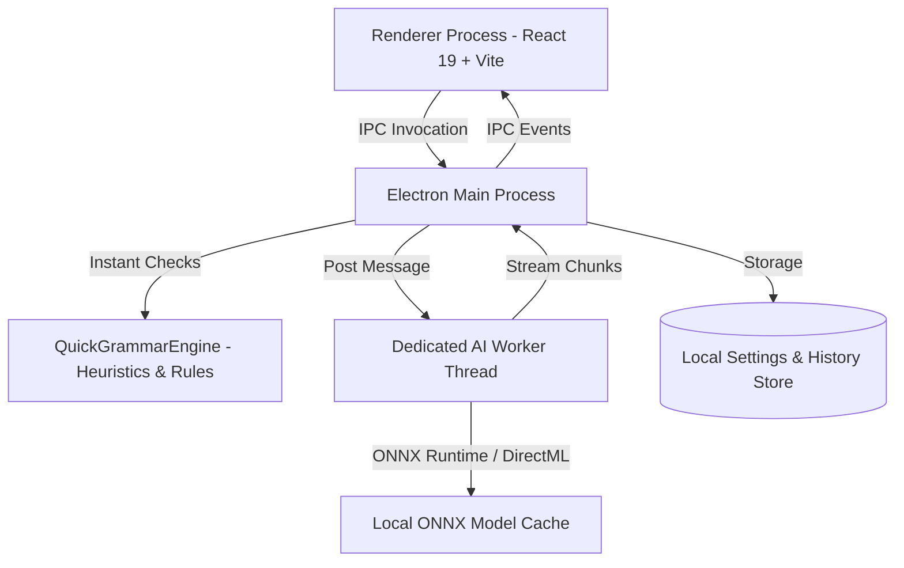

<div align="center">

# ✨ AI Grammar Studio

**Private, offline-first intelligent writing assistant powered by local on-device AI.**

[](https://react.dev/)
[](https://www.typescriptlang.org/)
[](https://www.electronjs.org/)
[](https://vitejs.dev/)
[](https://onnxruntime.ai/)
[](https://learn.microsoft.com/en-us/windows/ai/directml/dml)
[](LICENSE)

<br />

[Features](#-key-features) • [Architecture](#-architecture) • [Getting Started](#-getting-started) • [Build & Packaging](#-build--packaging) • [Tech Stack](#-tech-stack) • [License](#-license)

</div>

---

## 📖 Overview

**AI Grammar Studio** is a modern desktop writing environment designed from the ground up for **absolute privacy and zero data leakage**. Unlike traditional writing tools that transmit your keystrokes to cloud servers, AI Grammar Studio executes 100% of its spell check, grammar correction, tone rewriting, and syntactic parsing locally on your machine.

---

## 🚀 Key Features

### ⚡ Dual Grammar Processing Engines
- **Instant Heuristic Engine**: Sub-millisecond rule-based spelling correction (NSpell + Hunspell), readability scores, cliché detection, and passive voice warnings.
- **Deep Neural Engine**: Local LLM and Seq2Seq neural network inference running directly on your CPU or GPU.

### 🧠 On-Device Neural Models (ONNX Runtime + DirectML)
Download and switch between state-of-the-art quantized open-weights models with a single click:
- **Qwen 2.5** (0.5B / 1.5B) – Fast, coherent grammar corrections and natural text transformations.
- **Gemma 2B** – Google's lightweight open model optimized for stylistic rewrites.
- **Llama 3.2** (1B / 3B) – High-reasoning writing assistant.
- **Flan-T5** (Small / Base / Large) – Reliable instruction-following and grammar editing.
- **GEC-T5 Small** – Specialized 80M parameter grammar error correction.
- **T5 Base (Grammar)** – Purpose-built grammar refinement model.
- **CoEdIT Large** – Grammarly's 783M parameter text-editing model.

### 🎨 Creative Studio & Tone Rewriting
Transform text dynamically into multiple writing styles with real-time streaming output:
- `Academic` • `Professional` • `Casual` • `Concise` • `Creative` • `Confident` • `Friendly`

### 🔬 Deep Linguistic Analysis
- **Voice Transformation**: Automated conversion between Active Voice and Passive Voice.
- **Narration Conversion**: Convert between Direct Speech and Indirect Speech.
- **Degrees of Comparison**: Transform adjectives across Positive, Comparative, and Superlative degrees.
- **Clause Breakdown**: Identify Main clauses, Subordinate clauses, and Relative clauses.
- **Tense & Timeline Mapping**: Detect grammatical tense and map verbs onto a chronological timeline.
- **Parts of Speech (POS)**: Color-coded tokenized syntax breakdown.

### 🔒 Privacy & Performance
- **Zero Telemetry**: No cloud APIs, analytics, or external trackers.
- **Hardware Acceleration**: Automatic GPU detection (NVIDIA CUDA / AMD ROCm / Intel Arc) via DirectML.
- **Worker Thread Isolation**: AI model inference runs in a dedicated background `worker_thread` to ensure a smooth, 60fps UI.

---

## 🏗 Architecture



---

## 💻 Getting Started

### Prerequisites
- **Node.js**: v18.0.0 or higher
- **npm**: v9.0.0 or higher
- **OS**: Windows 10/11 (x64)

### Installation

1. **Clone the repository**:
   ```bash
   git clone https://github.com/sayandey021/AI-Grammar-Studio.git
   cd AI-Grammar-Studio
   ```

2. **Install dependencies**:
   ```bash
   npm install
   ```

3. **Start in Development Mode**:
   ```bash
   npm run dev
   ```
   *This starts the Vite React development server with Hot Module Replacement (HMR) and launches the Electron desktop shell.*

---

## 📦 Build & Packaging

AI Grammar Studio includes automated Windows build scripts located in the `scripts/` directory:

| Script | Command | Description |
| :--- | :--- | :--- |
| **`scripts/build_all.bat`** | `npm run build:all` | Compiles frontend/backend and creates both **`.EXE`** and **`.MSIX`** in `dist/`. |
| **`scripts/build_exe.bat`** | `npm run build:exe` | Generates a standalone **NSIS Windows Installer (`.exe`)**. |
| **`scripts/build_msix.bat`** | `npm run build:msix` | Generates a signed **Windows Store Package (`.msix` / `.appx`)**. |
| **`scripts/change_version.bat`** | `npm run set-version` | Interactively updates version numbers across `package.json` and manifests. |

---

## 📁 Repository Structure

```
├── .github/                  # GitHub Actions CI, issue templates & PR guidelines
├── assets/                   # Application icons & visual branding assets
├── build/                    # AppX / MSIX packaging resources and tile logos
├── scripts/
│   ├── build_all.bat         # Unified build script (.EXE + .MSIX)
│   ├── build_exe.bat         # Standalone Windows NSIS installer builder
│   ├── build_msix.bat        # Microsoft Store package builder
│   ├── change_version.bat    # Interactive version management script
│   ├── generate-icons.ps1    # PowerShell script to generate AppX store logo variants
│   └── set-version.js        # Automated semantic version updater
├── src/
│   ├── main/                 # Electron Main Process
│   │   ├── grammar/          # Rule-based quick grammar & spell engine
│   │   ├── models/           # ONNX model manager & download coordinator
│   │   ├── aiWorker.ts       # Isolated background worker for AI inference
│   │   ├── index.ts          # Main process entry, IPC handlers, window lifecycle
│   │   ├── preload.ts        # Secure contextBridge IPC bridge
│   │   └── storage.ts        # Persistent JSON storage for user settings & history
│   └── renderer/             # React 19 Frontend (Vite)
│       ├── src/
│       │   ├── components/   # Reusable UI components (Navbar, Sidebar, Modals)
│       │   ├── pages/        # Main pages (Editor, Studio, Analysis, Settings, About)
│       │   ├── styles/       # Design system & custom CSS themes
│       │   ├── App.tsx       # Root layout & route coordination
│       │   └── main.tsx      # React DOM entry point
│       └── index.html        # HTML shell
├── .gitignore                # Git ignore patterns
├── CHANGELOG.md              # Detailed release history & migration notes
├── CONTRIBUTING.md           # Contribution guidelines & development conventions
├── LICENSE                   # ISC Open Source License
├── package.json              # Project configuration & build target definitions
├── tsconfig.json             # Renderer TypeScript configuration
├── tsconfig.node.json        # Main process TypeScript configuration
├── vite.config.ts            # Vite bundler configuration
└── vitest.config.ts          # Unit test configuration
```

---

## 🛠 Tech Stack

| Domain | Technology |
| :--- | :--- |
| **Desktop Shell** | [Electron 43](https://www.electronjs.org/) |
| **Frontend Framework** | [React 19](https://react.dev/) |
| **Language** | [TypeScript 7](https://www.typescriptlang.org/) |
| **Bundler & Tooling** | [Vite 8](https://vitejs.dev/) |
| **Local AI Engine** | [@xenova/transformers](https://huggingface.co/docs/transformers.js) + [ONNX Runtime Node](https://onnxruntime.ai/) |
| **GPU Acceleration** | Microsoft DirectML (NAPI v6) |
| **Natural Language Heuristics** | [Compromise](https://compromise.cool/), [NSpell](https://github.com/wooorm/nspell), [Write-Good](https://github.com/btford/write-good) |
| **Icons** | [Lucide React](https://lucide.dev/) |
| **Test Runner** | [Vitest 4](https://vitest.dev/) |
| **Packager** | [electron-builder 26](https://www.electron.build/) (NSIS + AppX/MSIX) |

---

## 🧪 Testing

Run unit tests via Vitest:
```bash
npm test
```

---

## 🤝 Contributing

Contributions, bug reports, and feature suggestions are welcome! Please check out [CONTRIBUTING.md](CONTRIBUTING.md) for local workflow details.

---

## 📄 License

This project is licensed under the [GNU General Public License v3.0](LICENSE).
