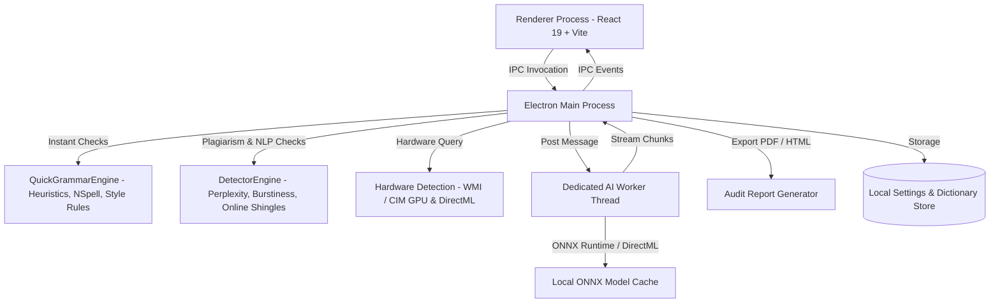

<div align="center">

# ✨ AI Grammar Studio

**Private, offline-first intelligent writing, translation & content intelligence studio powered by local on-device AI.**

[](https://react.dev/)
[](https://www.typescriptlang.org/)
[](https://www.electronjs.org/)
[](https://vitejs.dev/)
[](https://onnxruntime.ai/)
[](https://learn.microsoft.com/en-us/windows/ai/directml/dml)
[](https://github.com/facebookresearch/fairseq/tree/nllb)
[](LICENSE)

<br />

[Features](#-key-features) • [Supported Models](#-supported-on-device-models) • [Architecture](#-architecture) • [Getting Started](#-getting-started) • [Build & Packaging](#-build--packaging) • [Tech Stack](#-tech-stack) • [License](#-license)

</div>

---

## 📖 Overview

**AI Grammar Studio** is a modern desktop writing environment designed from the ground up for **absolute privacy and zero data leakage**. Unlike traditional writing tools that transmit your sensitive keystrokes, corporate memos, or creative drafts to cloud servers, AI Grammar Studio executes 100% of its spell check, grammar correction, style enhancement, multi-lingual neural translation, AI content detection, plagiarism auditing, and syntactic parsing locally on your machine.

Whether running on a discrete GPU with **Microsoft DirectML** acceleration or an ultra-low-power CPU, AI Grammar Studio delivers private, low-latency, and unconstrained writing intelligence.

---

## 🚀 Key Features

### 🖥️ Modern Studio Dashboard & Command Hub
- **Quick-Start Launcher Strip**: Interactive instant-action banner to jump straight into the Grammar Editor or paste text from the clipboard with 1-click.
- **Structured Workflow Grids**: Clean separation into *Writing & Language Studios* (Grammar & Style Editor, Creative Writing, Neural Translation) and *Linguistics, Auditing & Preferences* (Deep Linguistic Analysis, AI & Plagiarism Detector, Models & Hardware).
- **Live System Telemetry & Health Bar**: Real-time indicators displaying 100% on-device privacy status, active grammar engine (dynamically resolved to the active model name or heuristic rules), compute backend (`AMD DirectML`, `NVIDIA CUDA`, `Intel DirectML`, or `CPU`), and App Info shortcuts.

### ⚡ Dual Grammar & Style Processing Engines
- **Instant Heuristic Engine**: Sub-millisecond rule-based spelling correction ([NSpell](https://github.com/wooorm/nspell) + [Hunspell](https://github.com/wooorm/dictionary-en)), readability scoring (Flesch-Kincaid), cliché detection, passive voice warnings, homophone & preposition alignment, double negative & comma splice fixes, and persistent custom user dictionaries.
- **Deep Neural Engine**: Local Seq2Seq neural models running directly on your CPU or GPU via ONNX Runtime to perform context-aware grammatical restructuring and stylistic polishing.

### 🌐 100% Offline Neural Translation Studio (Meta NLLB-200)
- **200+ Global Languages**: Powered by Meta's **NLLB-200 Distilled (600M Q4 Quantized)** (`Xenova/nllb-200-distilled-600M`), enabling high-fidelity multilingual translation completely offline with zero external API calls or subscription keys.
- **Dual-Pane Split Workbench**: Source and target workbenches featuring live character/word counters, sample text loader, keyboard shortcuts (`Ctrl + Enter` / `Cmd + Enter`), and fast copy actions.
- **Searchable Language Selector**: Quick-pick pills for top languages (English, Spanish, French, German, Hindi) plus a searchable dropdown supporting 35+ major languages with localized native names.
- **1-Click Editor Integration**: Seamlessly transfer translated text directly into the main Grammar Studio workspace via the *"Open in Editor"* action.
- **Dynamic AI Status Pill**: Reactive indicator displaying `⚡ Local AI Online` or `⚠ Local AI Offline` with dedicated model management in Settings.

### 🛡️ Plagiarism & AI Content Detector Suite
- **Statistical NLP AI Detection**: Evaluates word entropy, average perplexity, and sentence/document-level burstiness index (sentence length variation) with 100% offline privacy.
- **Local Neural Classifier Ensemble**: Integrates quantized neural classification models (including **ModernBERT RAID AI Detector**, **TMR AI Text Detector**, and **RoBERTa OpenAI Detector**) for hybrid ensemble scoring that detects text generated by GPT-4o, Claude 3.5, Gemini, and Llama 3.
- **Dual-Mode Plagiarism Scanner**:
  - **100% Offline Mode**: Detects internal structural self-duplication and includes a **Local Reference Document Comparator** using N-Gram Containment Measurement to cross-verify text against local files (`.txt`, `.md`, `.docx`).
  - **Online Web Mode (Toggleable)**: Extracts semantic n-gram shingles to scan public search indexes and the Wikipedia Open Search API with in-memory LRU caching, deduplication, and lightweight payload guards.
- **Interactive Sentence Heatmap**: Visual color-coded highlighting (`Human`, `Mixed`, `Likely AI`, `Heavy AI`) with click-to-inspect sentence inspection cards.
- **Enterprise Audit Report Generator**: Official Certificate of Originality & AI Content Verification Report featuring verification IDs, document timestamps, visual score dials, and 1-click **PDF Export** (via Electron native `printToPDF()`), **HTML Export**, JSON clipboard export, and direct printing.

### 🎨 Creative Studio & Prompt Lab
- **Multi-Style Tone Rewriting**: Dynamically adapt text across 7 distinct writing modes:
  - `Academic` • `Professional` • `Casual` • `Concise` • `Creative` • `Confident` • `Friendly`
- **Streaming Local LLM Generation**: Real-time token streaming powered by modern open-weights instruction models (Qwen 3, Gemma 3, Llama 3.2, Qwen 2.5) with `<think>` reasoning support.

### 🔬 Deep Linguistic Analysis
- **Voice Transformation**: Automated conversion between Active Voice and Passive Voice with agentless passive handling and stative verb validation.
- **Narration Conversion**: Intelligent transformation between Direct Speech and Indirect Speech with pronoun backshifting, modal shifts, and exclamatory assertions.
- **Degrees of Comparison**: Transform adjectives seamlessly across Positive, Comparative, and Superlative degrees.
- **Clause Breakdown**: Classify sentences into Main clauses, Subordinate clauses, and Relative clauses.
- **Tense & Timeline Mapping**: Detect grammatical tense formulas and position verb phrases chronologically.
- **Parts of Speech (POS)**: Color-coded tokenized syntax breakdown visualizer.

### ⚡ Precision GPU Hardware Detection & Acceleration
- **Native WMI/CIM Hardware Queries**: Directly queries physical GPU hardware in the Electron main process to capture GPU model names, dedicated VRAM capacity (e.g. `Radeon RX 570 Series (4 GB VRAM)`), and driver information.
- **Virtual Display Adapter Filtering**: Automatically ignores software and virtual adapters (e.g., Parsec, RDP, Basic Display).
- **Intelligent Compute Backend Selection**: Glassmorphic hardware banner in Settings displaying detected GPU chips, dedicated VRAM badges, vendor acceleration tags (`AMD DirectML`, `NVIDIA CUDA`, `Intel DirectML`), and safe fallback confirmation modals.

### 🪟 Modernized Desktop Experience
- **Frameless Custom Themed TitleBar**: Native window dragging, dynamic page breadcrumbs with Lucide icons, live engine status indicator (`⚡ Local AI Ready` / `✨ Fast Heuristic Engine`), custom window controls, and quick theme toggle (Dark `#05070d` & Light `#f8f9fa`).
- **Multi-Metric Bottom Status Bar**: Live word count, character count, estimated reading time, suggestion count badge, and glowing model status light.
- **Custom Glassmorphic Modals**: High-fidelity confirmation dialogs for model deletion, downloads, and fallback notices.

---

## 🧠 Supported On-Device Models

All models run 100% locally on your device through `@xenova/transformers` and `onnxruntime-node` with Q4/int8 quantization for low RAM/VRAM footprint:

| Category | Model Name | Hugging Face Repository | Parameters | Size | Specialty |
| :--- | :--- | :--- | :---: | :---: | :--- |
| **Grammar** | **Gec-T5 Small** | `JonaWhisper/jonawhisper-gec-t5-small-onnx` | 80M | ~120 MB | Ultra-fast, lightweight grammar correction |
| **Grammar** | **Flan-T5 Base** | `onnx-community/t5-base-grammar-correction-ONNX` | 250M | ~350 MB | Purpose-built grammar refinement |
| **Grammar** | **Flan-T5 Large** | `Xenova/LaMini-Flan-T5-783M` | 783M | ~850 MB | Deep instruction-following & structural edits |
| **Grammar** | **CoEdIT Large** | `imrahamed/coedit-large-webgpu-onnx` | 783M | ~3.2 GB | Grammarly's state-of-the-art text-editing model |
| **Creative** | **Qwen 3** | `onnx-community/Qwen3-0.6B-ONNX` | 0.6B | ~877 MB | Fast creative generation & `<think>` reasoning |
| **Creative** | **Gemma 3** | `onnx-community/gemma-3-1b-it-ONNX` | 1.0B | ~860 MB | Google's compact instruction-tuned model |
| **Creative** | **Llama 3.2** | `onnx-community/Llama-3.2-1B-Instruct-ONNX` | 1.2B | ~1.6 GB | Meta's high-reasoning writing assistant |
| **Creative** | **Qwen 2.5** | `onnx-community/Qwen2.5-1.5B-Instruct` | 1.5B | ~900 MB | Coherent text generation & tone rewriting |
| **Creative** | **Qwen 3** | `onnx-community/Qwen3-1.7B-ONNX` | 1.7B | ~1.4 GB | Advanced creative writing & `<think>` reasoning |
| **Detector** | **ModernBERT RAID AI Detector** | `onnx-community/modernbert-ai-detection-raid-mage-ONNX` | 149M | ~144 MB | SOTA detection for GPT-4o, Claude 3.5, Gemini, Llama 3 |
| **Detector** | **TMR AI Text Detector** | `onnx-community/tmr-ai-text-detector-ONNX` | 125M | ~125 MB | Neural AI text classifier |
| **Detector** | **RoBERTa OpenAI Detector** | `onnx-community/roberta-base-openai-detector-ONNX` | 125M | ~125 MB | Fine-tuned OpenAI classifier |
| **Translation** | **Meta NLLB-200** | `Xenova/nllb-200-distilled-600M` | 600M | ~875 MB | 100% offline translation across 200+ global languages |

---

## 🏗 Architecture



---

## 💻 Getting Started

### Prerequisites
- **Node.js**: v18.0.0 or higher
- **npm**: v9.0.0 or higher
- **OS**: Windows 10/11 (x64)

### Installation

1. **Clone the repository**:
   ```bash
   git clone https://github.com/sayandey021/AI-Grammar-Studio.git
   cd AI-Grammar-Studio
   ```

2. **Install dependencies**:
   ```bash
   npm install
   ```

3. **Start in Development Mode**:
   ```bash
   npm run dev
   ```
   *This starts the Vite React development server with Hot Module Replacement (HMR), compiles the TypeScript main process, and launches the Electron desktop shell.*

---

## 📦 Build & Packaging

AI Grammar Studio includes automated Windows build scripts located in the `scripts/` directory:

| Script | Command | Description |
| :--- | :--- | :--- |
| **`scripts/build_all.bat`** | `npm run build:all` | Compiles frontend/backend and creates both **`.EXE`** and **`.MSIX`** in `dist/`. |
| **`scripts/build_exe.bat`** | `npm run build:exe` | Generates a standalone **NSIS Windows Installer (`.exe`)**. |
| **`scripts/build_msix.bat`** | `npm run build:msix` | Generates a signed **Windows Store Package (`.msix` / `.appx`)**. |
| **`scripts/change_version.bat`** | `npm run set-version` | Interactively updates version numbers across `package.json` and manifests. |
| **`scripts/generate-icons.ps1`** | — | PowerShell script to generate all AppX / MSIX tile logo asset scales. |

---

## 📁 Repository Structure

```
├── .github/                  # GitHub Actions CI, issue templates & PR guidelines
├── assets/                   # Application icons & visual branding assets
├── build/                    # AppX / MSIX packaging resources and tile logos
├── scripts/
│   ├── build_all.bat         # Unified build script (.EXE + .MSIX)
│   ├── build_exe.bat         # Standalone Windows NSIS installer builder
│   ├── build_msix.bat        # Microsoft Store package builder
│   ├── change_version.bat    # Interactive version management script
│   ├── generate-icons.ps1    # PowerShell script to generate AppX store logo variants
│   └── set-version.js        # Automated semantic version updater
├── src/
│   ├── main/                 # Electron Main Process
│   │   ├── detector/         # Plagiarism & AI detection engine (NLP, entropy, shingling)
│   │   │   ├── detectorEngine.ts
│   │   │   └── detectorEngine.test.ts
│   │   ├── grammar/          # Rule-based quick grammar, style & linguistic engines
│   │   │   ├── rules/        # Narration, voice, degree, dictionary, typography rules
│   │   │   ├── AIGrammarEngine.ts
│   │   │   ├── QuickGrammarEngine.ts
│   │   │   └── QuickGrammarEngine.test.ts
│   │   ├── models/           # ONNX model manager & direct HTTPS download coordinator
│   │   │   └── ModelManager.ts
│   │   ├── aiWorker.ts       # Isolated background worker thread for AI inference
│   │   ├── index.ts          # Main process entry, IPC handlers, WMI GPU query, window lifecycle
│   │   ├── preload.ts        # Secure contextBridge IPC bridge
│   │   └── storage.ts        # Persistent JSON storage for user settings & custom dictionaries
│   └── renderer/             # React 19 Frontend (Vite)
│       ├── src/
│       │   ├── components/   # Reusable UI components (Sidebar, TitleBar, ConfirmModal, ReportModal)
│       │   ├── pages/        # Studio pages (Dashboard, Editor, Prompt, Translation, Detector, Analysis, Settings, About)
│       │   ├── styles/       # Design system, glassmorphism tokens & custom CSS themes
│       │   ├── App.tsx       # Root layout & studio view routing
│       │   └── main.tsx      # React DOM entry point
│       └── index.html        # HTML shell
├── .gitignore                # Git ignore patterns
├── CHANGELOG.md              # Detailed release history & migration notes
├── CONTRIBUTING.md           # Contribution guidelines & development conventions
├── LICENSE                   # GPL-3.0 Open Source License
├── package.json              # Project configuration & build target definitions
├── tsconfig.json             # Renderer TypeScript configuration
├── tsconfig.node.json        # Main process TypeScript configuration
├── vite.config.ts            # Vite bundler configuration
└── vitest.config.ts          # Unit test configuration
```

---

## 🛠 Tech Stack

| Domain | Technology | Description |
| :--- | :--- | :--- |
| **Desktop Shell** | [Electron 43](https://www.electronjs.org/) | Cross-platform Chromium & Node.js desktop framework |
| **Frontend Framework** | [React 19](https://react.dev/) | Component architecture & modern state management |
| **Language** | [TypeScript 7](https://www.typescriptlang.org/) | Strict type safety across main and renderer processes |
| **Bundler & Tooling** | [Vite 8](https://vitejs.dev/) | Lightning-fast HMR and optimized production bundling |
| **Local AI Engine** | [@xenova/transformers](https://huggingface.co/docs/transformers.js) | Local ONNX pipeline execution for Seq2Seq, LLMs, and classifiers |
| **GPU Acceleration** | Microsoft DirectML (NAPI v6) | Cross-vendor GPU acceleration for AMD, NVIDIA, and Intel hardware |
| **Translation Engine** | Meta NLLB-200 Distilled | 100% offline multilingual translation across 200+ languages |
| **AI Detection & Audit** | ModernBERT RAID + NLP Metrics | Quantized neural classifiers & entropy/perplexity statistical metrics |
| **Natural Language Heuristics** | [Compromise](https://compromise.cool/), [NSpell](https://github.com/wooorm/nspell), [Write-Good](https://github.com/btford/write-good) | Sub-millisecond spelling, style, and syntactic parsing |
| **Icons** | [Lucide React](https://lucide.dev/) | Clean, consistent vector iconography |
| **Test Runner** | [Vitest 4](https://vitest.dev/) | Fast unit testing for grammar and detector engines |
| **Packager** | [electron-builder 26](https://www.electron.build/) | NSIS standalone installer and signed AppX / MSIX packaging |

---

## 🧪 Testing

Run comprehensive unit tests covering the grammar rule engine and AI/plagiarism detector via Vitest:
```bash
npm test
```

---

## 🤝 Contributing

Contributions, bug reports, and feature suggestions are welcome! Please check out [CONTRIBUTING.md](CONTRIBUTING.md) for local development workflows and guidelines.

---

## 📄 License

This project is licensed under the [GNU General Public License v3.0](LICENSE).
